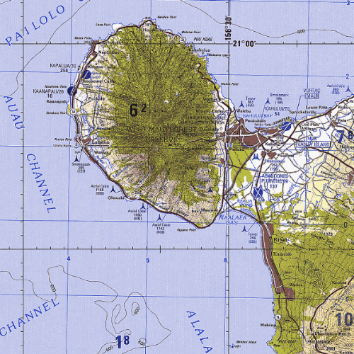

#Raster layer (mosaic dataset)

This sample demonstrates how to display mobile mosaic datasets with a RasterLayer.

##How it works
A `MosaicDatasetRaster` is created from the local file URL of a mobile mosaic dataset. Next, this `MosaicDatasetRaster` is used to construct a new `RasterLayer`. Finally, the `RasterLayer` is added to a new `Basemap`, and the `Basemap` is added to a `Map`. The mobile mosaic dataset was converted from Mosaic Dataset using the `Mosaic Dataset To Mobile Mosaic Dataset` geoprocessing tool in ArcGIS Pro.

##Features
- MosaicDatasetRaster
- RasterLayer
- Basemap
- Map
- MapView
