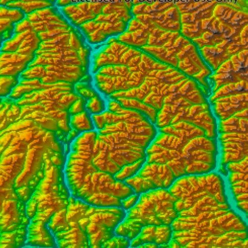

#Raster function

This sample shows how to apply a raster function to a raster, and render the resulting layer on a map.

##How it works
A `RasterFunction` is created from a JSON file that contains a raster function. Then, raster arguments are specified according to the requirements of the raster function in the JSON file. Next, a `Raster` is created from the `RasterFunction`, and the `Raster` is then used to create a `RasterLayer`. Finally, the `RasterLayer` is added to the basemap, and displayed on the `Map`.

##Features
RasterFunction
RasterFunctionArguments
Raster
RasterLayer
Map
MapView
Basemap
